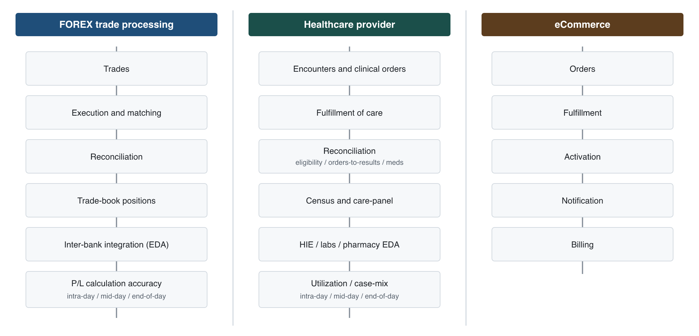
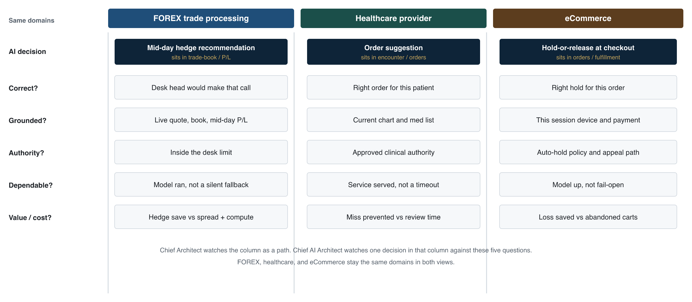

# Architecture And AI Architecture Metrics Reference

This repo is designed as a working reference for distinguishing the responsibility, information needs, and dashboard priorities of a Chief Architect and a Chief AI Architect.

## Introduction

The two roles are related but not interchangagle:

### The Chief Architect 
The Chief Architect is accountable for the health of the end-to-end business and technology architecutre.

The Chief Architect dashboards should show whether customers can move reliably from one business service/capability through other.

For example:

This table represents the end-to-end business services/capabilities for each domain.

| Domain | End-to-end capability chain |
|---|---|
| FOREX trade processing | Trades → execution and matching → reconciliation → trade-book position management → inter-bank integration (EDA) → intra-day, mid-day, and end-of-day P/L calculation processing and their accuracy |
| Healthcare provider | Encounters and clinical orders → fulfillment of care services → reconciliation of eligibility, orders-to-results, and medications → census and care-panel position management → integration with HIEs, labs, pharmacies, and payer eligibility (EDA) → intra-day, mid-day, and end-of-day utilization and case-mix calculation processing and their accuracy |
| eCommerce | Orders → fulfillment of products purchased in the order → activation → notification → billing |

#### What above means

These examples are not feature lists. They are the end-to-end capability chains a Chief Architect dashboard should watch: can work move reliably from one business service to the next, and are the calculations those services depend on accurate?

**FOREX trade processing**

- **Trades, execution, and matching** — a deal is captured, filled against a price, and paired with the counterparty so both sides agree what traded.
- **Reconciliation** — internal books, counterparty confirms, and settlement instructions are compared until breaks are cleared.
- **Trade-book position management** — each desk’s open inventory (long/short by currency pair) stays current as trades print.
- **Inter-bank integration (EDA)** — quotes, fills, confirms, and settlement events arrive from other banks as events, not as batch files that wait until night.
- **Intra-day, mid-day, and end-of-day P/L, and their accuracy** — P/L is a real calculation on a clock. Intra-day is the running mark-to-market as prices move. Mid-day is a checkpoint for the desk. End-of-day is the official books-and-records number. The dashboard question is not only “did P/L run?” but “is that number right?”

**Healthcare provider**

Same kinds of capabilities, not the same words:

| FOREX | Healthcare analog | What it actually is |
|---|---|---|
| Reconciliation | Eligibility, orders-to-results, and medications | Coverage was good before the visit; every lab/imaging order got a result back; the med list on the chart matches what the patient is actually taking. |
| Trade-book position management | Census and care-panel position management | How many patients are in beds, in the ED, or on a physician’s panel — the hospital’s live inventory of care. |
| Inter-bank integration (EDA) | HIEs, labs, pharmacies, and payer eligibility (EDA) | Results, referrals, prescriptions, and eligibility checks arrive as events from outside organizations. Payers show up here as an eligibility feed, not as “the provider runs claims.” |
| Intra-day / mid-day / EOD P/L accuracy | Intra-day / mid-day / EOD utilization and case-mix accuracy | Occupancy, ED boarding, OR throughput, and midnight census really do snapshot on those clocks. Case-mix / DRG grouping is usually after coding (end of encounter or month-end), not a mid-day job. |

A provider **does** create and submit claims — that is revenue cycle, after the care. They do not adjudicate claims; the payer does. Claims/payments are therefore the wrong center of this example, the same way “notification and billing” was the boring end of every industry chain.

**“Quality” is a weak analog for those clocks.** Infection rates, readmissions, HEDIS, and CMS measures are typically monthly, quarterly, or annual. “Intra-day quality” does not mean care quality at noon. The honest clocked calculations in a hospital are census, occupancy, throughput, and case-mix close.

**eCommerce** is the simpler consumer version of the same idea: an order is taken, the product is fulfilled, the service or device is activated, the customer is notified, and the bill is cut. Notification and billing show up in every industry; they are the least distinctive part of the chain.

### The Chief AI Architect
The Chief AI Architect is accountable for the safe, explainable, economical, and governed use of AI in that architecture (above busienss and technology architectures).

The Chief AI Architect dashboards should show whether AI decisions are correct, grounded in evidence, within approved authority, operationally dependable, and producing measurable value.

For example:

These are not end-to-end journeys. The Chief Architect already watches the pipe. The Chief AI Architect watches one AI decision that sits *inside* a joint of that pipe — and asks whether that decision was right, grounded, allowed, actually served, and worth its cost.

**FOREX — a mid-day hedge recommendation.** At 11:40 the model tells the desk to cut EUR exposure. The Chief Architect cares that mid-day P/L and the trade book still close. The Chief AI Architect cares: would a desk head have made that call on this book? Was the quote live or stale? Did the recommendation stay inside the desk limit, or did it silently breach? Did the model run, or did a fallback fire unnoticed? Did the hedge save more than spread plus compute?

**Healthcare provider — an order suggestion in the encounter.** The Chief Architect cares that the order is placed, resulted, and reconciled. The Chief AI Architect cares: did clinical decision support suggest the right order for *this* patient? Was it grounded in the current chart and med list, or in a summary that dropped the allergy? Was the model allowed to recommend that class of order, or did it step outside approved clinical authority? Did the service time out and a nurse proceed without it? Did the suggestion prevent a miss worth more than the review time it added?

**eCommerce — hold-or-release at checkout.** The Chief Architect cares that the order moves to fulfillment, activation, and billing. The Chief AI Architect cares: did the fraud or risk model make the right hold? Was it grounded in this session’s device and payment evidence, or a recycled score from yesterday? Was auto-hold inside policy, or did it freeze a trusted customer without an appeal path? Was the model up, or did checkout fail open? Did the holds that were right save more loss than the false holds cost in abandoned carts?

#### What above means

These examples are not capability chains. The domains stay the same — FOREX, healthcare provider, eCommerce — so the two roles can be read against one another. The Chief Architect watches each domain as a path. The Chief AI Architect watches one AI decision *inside* that path, and runs the same five questions in every domain.

**The five questions (constant). The evidence (changes by domain).**

| Question | What it asks | FOREX — mid-day hedge | Healthcare — order suggestion | eCommerce — hold-or-release |
|---|---|---|---|---|
| Correct? | Would the accountable human have made this call? | Desk head would cut EUR on this book | Right order for this patient | Right hold for this order |
| Grounded? | Was the decision based on current evidence? | Live quote, book, mid-day P/L | Current chart and med list | This session’s device and payment |
| Authority? | Was the model allowed to do this? | Inside the desk limit | Approved clinical authority | Auto-hold policy and an appeal path |
| Dependable? | Did the model actually serve? | Model ran, not a silent fallback | Service served, not a timeout | Model up, not fail-open |
| Value / cost? | Was the decision worth what it consumed? | Hedge save vs spread + compute | Miss prevented vs review time | Loss saved vs abandoned carts |

Do not turn this into another journey map. If the diagram starts looking like trades → execution → settlement, it has slipped back into the Chief Architect view.

The same telemetry can feed both dashboards. The objects of attention are different: a broken path versus a bad, ungrounded, unauthorized, down, or too-expensive decision.

Both Chief Architect and Chief AI Architect roles share business outcomes and telemetry, but they ask different questions of the data.
- The Chief Architect asks, "Where is the journey or architecture failing?"
- The Chief AI Architect asks, "Did AI make or support the right decision, under the right controls, at an acceptable cost?"

The section following provides the leadership framing first. The section after provide the detailed definitions, formulas, scorecards, and implementaiton guidance.

## Table of Contents

- [Deep Understanding of Chief Architect Profile](#deep-understanding-of-chief-architect-profile)
  - [Chief Architect Role Profile](ChiefArchitect-RoleProfile.md)
  - [Chief Architect Dashboard Definitions](ChiefArchitect-Dashboard-Definitions.md)

## Deep Understanding of Chief Architect Profile

- [ChiefArchitect-RoleProfile.md](ChiefArchitect-RoleProfile.md) — what "where is the journey or architecture failing?" means, what the Chief Architect focuses on, and what they are responsible for.
- [ChiefArchitect-Dashboard-Definitions.md](ChiefArchitect-Dashboard-Definitions.md) — definitions used in the Chief Architect dashboard view.
